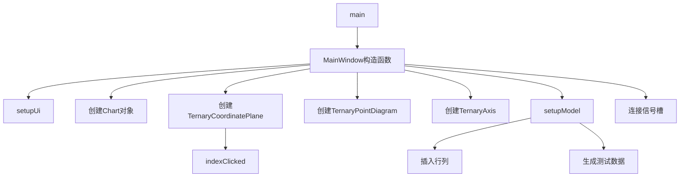

# 三元图表高级示例

## 示例概述
此示例展示了KD Chart库中三元图表的高级用法，特别是三元点图的实现和交互功能。通过这个示例，您可以了解如何创建、配置和使用三元坐标系统来可视化三维数据。

## 功能说明
1. 展示三元点图（TernaryPointDiagram）
2. 支持点击图表上的点以显示详细信息
3. 自定义三元坐标轴位置
4. 动态生成测试数据
5. 响应式UI布局

## 代码执行逻辑
```
main()
  └─ 创建QApplication实例
  └─ 创建MainWindow实例
     └─ MainWindow构造函数
        └─ 初始化UI
        └─ 创建KDChart::Chart对象
        └─ 创建并设置TernaryCoordinatePlane
        └─ 创建并设置TernaryPointDiagram
        └─ 添加三个不同位置的TernaryAxis
        └─ 设置图表布局
        └─ 调用setupModel()方法初始化数据
        └─ 连接图表点击信号到indexClicked槽函数
     └─ 显示窗口
  └─ 启动应用程序事件循环
```

## 关键代码解析

### 1. MainWindow构造函数
- 初始化UI组件和图表对象
- 创建三元坐标平面并替换默认的笛卡尔坐标平面
- 创建三元点图并设置到坐标平面
- 配置三个不同位置的三元坐标轴
- 设置数据模型并建立信号槽连接

### 2. setupModel方法
- 创建5行3列的数据模型
- 初始化每列的均等份额（1/3）
- 为每行生成带有轻微偏移的数据，创建有趣的视觉效果
- 设置模型数据

### 3. indexClicked槽函数
- 处理图表上点的点击事件
- 获取点击位置的模型索引
- 在标签上显示点击的行列信息

## 版本升级说明

### Qt5.15.2升级
- 需检查KDChart::TernaryPointDiagram API是否有变更
- 需检查KDChart::TernaryCoordinatePlane API是否有变更
- 确保所有Qt相关API调用与Qt5.15.2兼容

### C++17升级
- 考虑使用std::make_unique管理动态内存
- 考虑使用结构化绑定优化数据访问
- 考虑使用if constexpr优化条件判断

## Mermaid思维导图

### 类关系图
```mermaid
graph TD
    A[QDialog] <|-- B[MainWindow]
    B --> C[KDChart::Chart]
    B --> D[KDChart::TernaryCoordinatePlane]
    B --> E[KDChart::TernaryPointDiagram]
    B --> F[QStandardItemModel]
    E --> G[KDChart::TernaryAxis]
    E --> H[KDChart::TernaryAxis]
    E --> I[KDChart::TernaryAxis]
```

### 函数执行流程图
