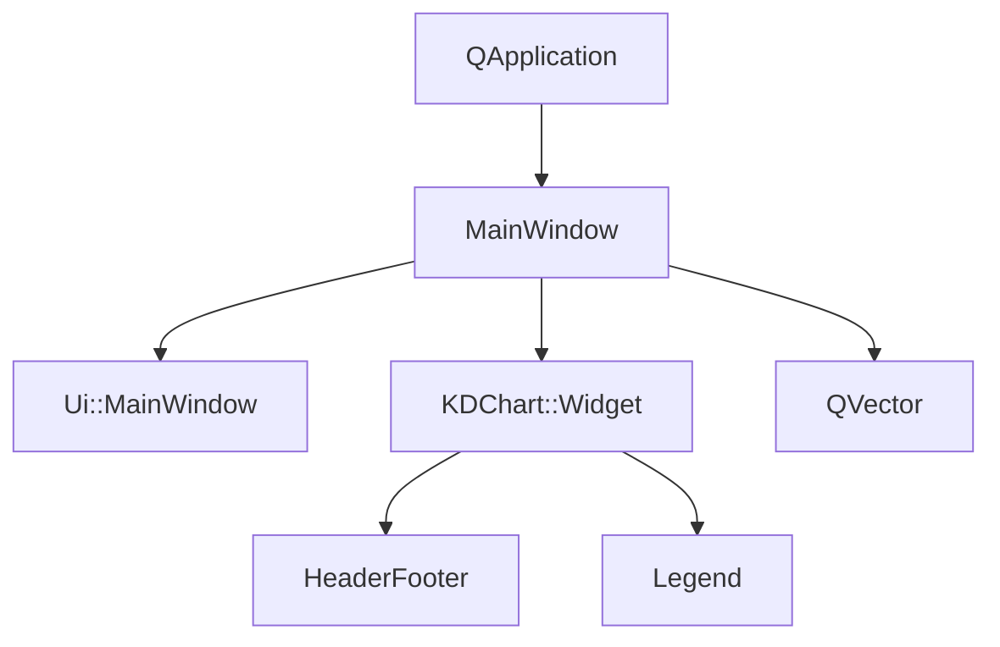
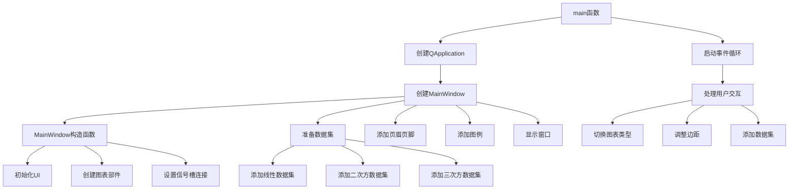

# Widget高级示例

## 概述
此示例展示了如何使用KDChart库的Widget类创建高级图表应用程序。该示例演示了添加多个数据集、自定义页眉页脚和图例的功能。

## 功能说明
1. 创建高级图表部件
2. 添加线性、二次方和三次方三个数据集
3. 自定义页眉和页脚（西、中、东三个位置）
4. 在东部添加图例
5. 支持切换图表类型、调整全局边距和添加新数据集的交互功能

## 代码结构
```
examples/Widget/Advanced/
├── CMakeLists.txt       # 构建配置文件
├── main.cpp             # 应用程序入口文件
├── mainwindow.cpp       # MainWindow类实现
├── mainwindow.h         # MainWindow类定义
└── mainwindow.ui        # UI设计文件
```

## 执行逻辑
1. 初始化QApplication
2. 创建MainWindow实例
3. MainWindow初始化图表部件和UI组件
4. 准备并添加三个数据集（线性、二次方、三次方）
5. 添加页眉、页脚和图例
6. 显示主窗口
7. 启动事件循环

## 关键代码解析
### main.cpp
- 创建应用程序和主窗口实例
- 准备并添加三个不同函数的数据集
- 配置图表的页眉、页脚和图例

### mainwindow.h
- 定义MainWindow类，继承自QWidget和Ui::MainWindow
- 包含KDChart::Widget指针作为主要图表部件
- 定义三个槽函数：切换图表类型、调整边距和添加数据集
- 包含数据集计数的私有成员变量

### mainwindow.cpp
- 实现MainWindow构造函数，初始化UI和图表部件
- 实现三个槽函数的具体逻辑
  - changeType：切换图表类型（折线图、面积图等）
  - changeLeading：调整图表的全局边距
  - addDataset：添加新的随机数据集
- 设置信号槽连接

## 版本升级说明
### Qt5.15.2升级
- 检查KDChart::Widget类的API是否有变更
- 检查HeaderFooter相关API是否有变更
- 确保所有信号槽连接语法符合Qt5.15.2标准
- 检查QVector等Qt容器类的使用是否有变化

### C++17升级
- 考虑使用std::vector替代QVector
- 考虑使用结构化绑定简化代码
- 可以使用C++17的if constexpr优化条件编译
- 考虑使用std::optional处理可能为空的值

## 执行逻辑关系
### 类关系图


### 函数执行流程图
