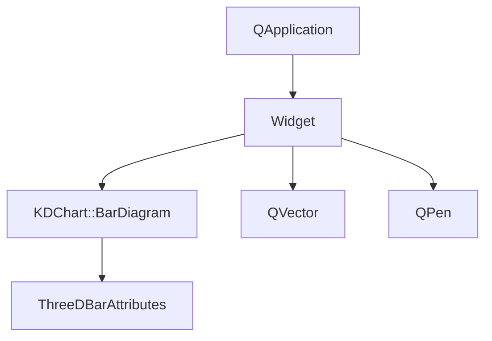
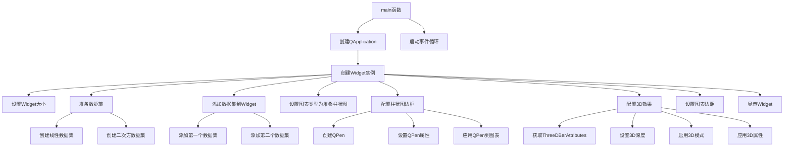

# Widget参数配置示例

## 概述
此示例展示了如何使用KDChart库的Widget类创建带有高级参数配置的图表应用程序。该示例演示了堆叠柱状图、3D效果、自定义边框等功能的实现。

## 功能说明
1. 创建基本图表部件
2. 添加两个数据集（线性和二次方数据）
3. 配置图表类型为堆叠柱状图
4. 自定义柱状图的边框样式
5. 设置3D柱状图效果
6. 调整图表的全局边距

## 代码结构
```
examples/Widget/Parameters/
├── CMakeLists.txt       # 构建配置文件
└── main.cpp             # 应用程序入口文件
```

## 执行逻辑
1. 初始化QApplication
2. 创建Widget图表部件实例
3. 准备两个数据集（线性和二次方数据）
4. 添加数据集到图表部件
5. 配置图表类型为堆叠柱状图
6. 设置柱状图的边框样式
7. 配置3D柱状图效果
8. 调整图表边距
9. 显示图表部件
10. 启动事件循环

## 关键代码解析
### main.cpp
- 创建应用程序和图表部件实例
- 准备并添加两个数据集
- 配置图表类型为堆叠柱状图
- 设置柱状图的边框样式：使用QPen设置宽度和颜色
- 配置3D效果：使用ThreeDBarAttributes设置深度和启用3D模式
- 调整图表边距：使用setGlobalLeadingTop设置顶部边距

## 版本升级说明
### Qt5.15.2升级
- 检查KDChart::Widget类的API是否有变更
- 检查ThreeDBarAttributes相关API是否有变更
- 确保QPen的使用方式符合Qt5.15.2标准
- 确认图表类型设置方法是否有变化

### C++17升级
- 考虑使用std::vector替代QVector
- 可以使用结构化绑定简化代码
- 可以使用C++17的if constexpr优化条件编译
- 考虑使用std::optional处理可能为空的值

## 执行逻辑关系
### 类关系图


### 函数执行流程图
