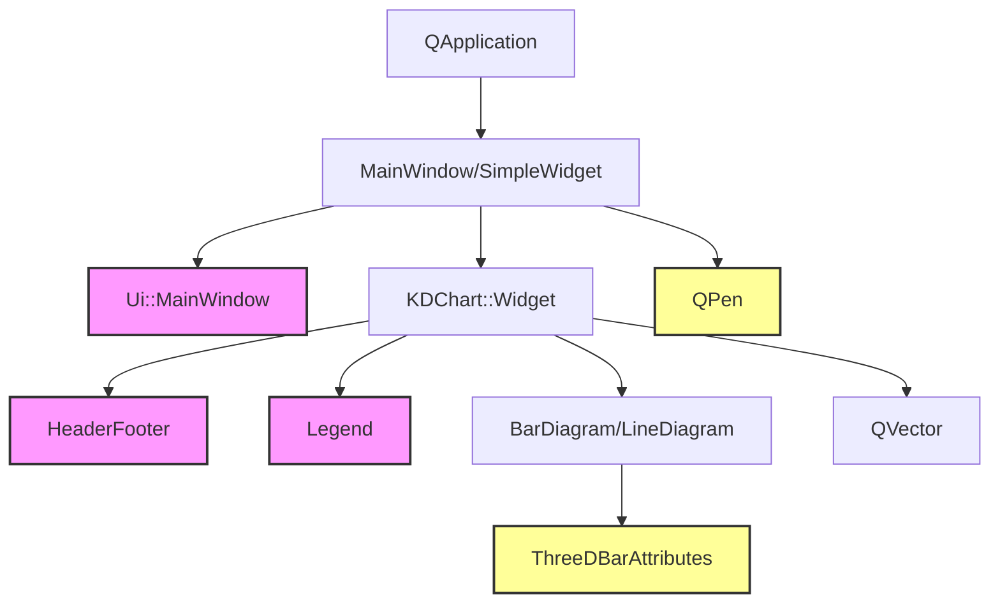
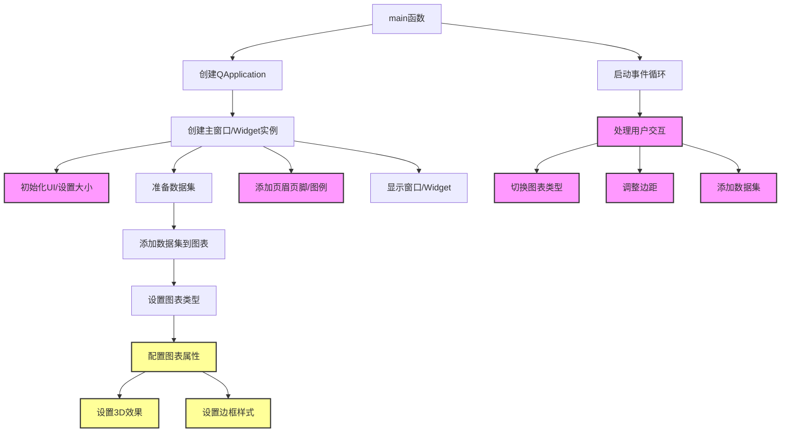

# Widget示例集合

## 概述
Widget目录包含了多个使用KDChart::Widget类创建图表的示例程序，展示了不同复杂度和功能的图表应用。这些示例涵盖了基本图表创建、高级交互功能以及参数配置等方面。

## 子目录功能简介
### Simple
- 基本的图表部件示例
- 展示如何创建线性、二次方和三次方函数的图表
- 代码简洁，适合入门学习

### Advanced
- 高级图表部件示例
- 包含多个数据集、自定义页眉页脚和图例
- 支持交互功能（切换图表类型、调整边距、添加数据集）
- 演示了更复杂的图表配置

### Parameters
- 参数配置示例
- 展示如何设置柱状图的3D效果、边框样式和堆叠模式
- 演示了图表边距调整

## 代码结构
```
examples/Widget/
├── Simple/              # 简单示例
│   ├── CMakeLists.txt
│   ├── main.cpp
│   └── README.md
├── Advanced/            # 高级示例
│   ├── CMakeLists.txt
│   ├── main.cpp
│   ├── mainwindow.cpp
│   ├── mainwindow.h
│   ├── mainwindow.ui
│   └── README.md
├── Parameters/          # 参数配置示例
│   ├── CMakeLists.txt
│   ├── main.cpp
│   └── README.md
└── README.md            # 本文件
```

## 版本升级说明
### Qt5.15.2升级
- 检查KDChart::Widget类的API是否有变更
- 检查相关组件（如HeaderFooter、ThreeDBarAttributes）的API是否有变更
- 确保信号槽连接语法符合Qt5.15.2标准
- 检查QVector等Qt容器类的使用是否有变化

### C++17升级
- 考虑使用std::vector替代QVector
- 可以使用结构化绑定简化代码
- 可以使用C++17的if constexpr优化条件编译
- 考虑使用std::optional处理可能为空的值

## 执行逻辑关系
### 类关系图


### 函数执行流程图


注：带阴影的节点表示仅在特定示例中存在的功能。