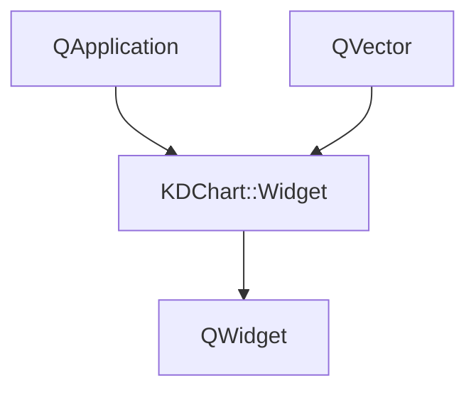
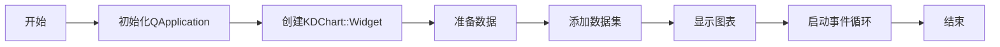

# Widget简单示例

## 概述

本示例展示了如何使用KDChart::Widget类快速创建一个包含三条曲线（线性、二次方和三次方）的图表。这是KD Chart库中最简单的图表示例之一，适合初学者了解KD Chart的基本用法。

## 功能说明

1. 创建一个KDChart::Widget图表部件
2. 准备三个数据集：
   - 线性数据（-5到5的连续整数）
   - 二次方数据（对应线性数据的平方值）
   - 三次方数据（对应线性数据的立方值）
3. 将数据集添加到图表并设置名称
4. 显示图表部件

## 代码结构

### 文件组成
- `main.cpp`: 应用程序入口文件，包含main函数
- `CMakeLists.txt`: CMake构建配置文件

### 核心类和函数
- `KDChart::Widget`: 图表部件类，负责绘制和显示图表
- `QApplication`: Qt应用程序类
- `main()`: 应用程序入口函数

## 代码执行逻辑

1. 初始化Qt应用程序对象
2. 创建KDChart::Widget图表部件实例并设置尺寸
3. 创建三个数据向量，分别存储线性、二次方和三次方数据
4. 使用setDataset方法将数据集添加到图表
5. 显示图表部件
6. 启动应用程序事件循环

## 关键代码解析

```cpp
// 创建图表部件
KDChart::Widget widget;
widget.resize(600, 600);

// 准备数据
QVector<qreal> vec0, vec1, vec2;
vec0 << -5 << -4 << -3 << -2 << -1 << 0 << 1 << 2 << 3 << 4 << 5;
vec1 << 25 << 16 << 9 << 4 << 1 << 0 << 1 << 4 << 9 << 16 << 25;
vec2 << -125 << -64 << -27 << -8 << -1 << 0 << 1 << 8 << 27 << 64 << 125;

// 添加数据集
widget.setDataset(0, vec0, "Linear");
widget.setDataset(1, vec1, "Quadratic");
widget.setDataset(2, vec2, "Cubic");
```

## 版本升级说明

### Qt 5.15.2 升级

1. **API兼容性检查**:
   - 需要验证KDChart::Widget在Qt5.15.2中的API兼容性
   - 检查QApplication构造函数在Qt5.15.2中的参数要求

2. **需要修改的函数/方法**:
   - `main()`: 检查QApplication和KDChart::Widget的使用方式

### C++17 升级

1. **主要调整点**:
   - 考虑使用std::array替代QVector以提高性能
   - 可使用结构化绑定优化变量声明

2. **需要修改的代码部分**:
   - 数据向量的声明和初始化部分

## 执行逻辑关系图

### 类关系图



### 函数执行流程图

