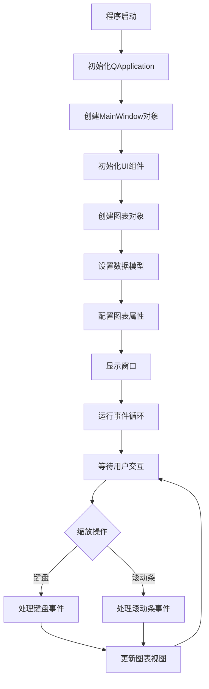

# Zoom 示例集合

## 概述

本目录包含了KDChart库中与图表缩放相关的示例。这些示例展示了不同的缩放方式，包括通过键盘控制和通过滚动条控制的缩放功能。

## 子目录功能简介

### Keyboard

- **功能**：展示如何通过键盘进行图表缩放和移动操作
- **主要文件**：main.cpp、mainwindow.cpp、mainwindow.h、zoomwidget.cpp、zoomwidget.h
- **特点**：
  - 支持通过PageUp/PageDown键进行缩放
  - 支持通过方向键进行平移
  - 支持鼠标点击设置缩放中心
  - 支持鼠标滚轮缩放
- **详细说明**：请参考 [Keyboard/README.md](Keyboard/README.md)

### ScrollBars

- **功能**：展示如何通过滚动条进行图表缩放和视图控制
- **主要文件**：main.cpp、mainwindow.cpp、mainwindow.h、mainwindow.ui
- **特点**：
  - 支持通过滑动条调整缩放因子
  - 提供水平和垂直滚动条控制图表视图
  - 支持自动调整网格到缩放比例
  - 支持橡皮筋缩放功能
- **详细说明**：请参考 [ScrollBars/README.md](ScrollBars/README.md)

## 类关系图

```mermaid
classDiagram
    class QApplication
    class QWidget
    class KDChart::Widget
    class KDChart::Chart
    class MainWindow
    class ZoomWidget
    class Ui::MainWindow

    QWidget <|-- KDChart::Widget
    QWidget <|-- KDChart::Chart
    QWidget <|-- MainWindow
    KDChart::Widget <|-- ZoomWidget
    Ui::MainWindow <|-- MainWindow

    MainWindow o-- ZoomWidget : contains
    MainWindow o-- KDChart::Widget : widget
    MainWindow o-- KDChart::Chart : m_chart
```

## 执行逻辑流程图



## 版本升级说明

### Qt5.15.2升级

1. **主要变更点**:
   - 检查QWidget、QApplication和Q_OBJECT宏在新版本中的使用
   - 验证KDChart::Widget和KDChart::Chart与Qt5.15.2的兼容性
   - 检查事件处理机制和信号槽连接方式在新版本中的变化

2. **影响范围**:
   - 所有涉及UI交互和事件处理的代码
   - 图表渲染和布局相关代码

3. **解决措施**:
   - 更新不兼容的API调用
   - 调整事件处理逻辑
   - 确保所有组件正确渲染

### C++17升级

1. **主要调整点**:
   - 考虑使用智能指针管理动态内存
   - 使用结构化绑定优化信号槽连接和坐标计算
   - 使用std::optional处理可能为空的指针
   - 检查对C++17标准库的依赖

2. **采用的新特性**:
   - 结构化绑定
   - std::optional
   - 智能指针

3. **兼容性处理**:
   - 替换过时的C++特性
   - 调整模板使用方式
   - 优化内存管理

## TODO列表

1. **Qt5.15.2升级**:
   - 检查QApplication和QVector在新版本中的使用方式
   - 验证KDChart::Widget与Qt5.15.2的兼容性
   - 检查QWidget和Q_OBJECT宏在新版本中的使用
   - 验证KDChart::Chart与Qt5.15.2的兼容性
   - 检查QWidget信号槽连接方式在新版本中的变化

2. **C++17升级**:
   - 考虑使用std::vector替代QVector以利用C++17特性
   - 使用结构化绑定和if constexpr优化代码结构
   - 考虑使用智能指针管理动态内存
   - 使用结构化绑定优化信号槽连接
   - 使用std::optional处理可能为空的指针
   - 利用结构化绑定优化坐标计算
   - 考虑使用结构化绑定优化代码
   - 检查对C++17标准库的依赖