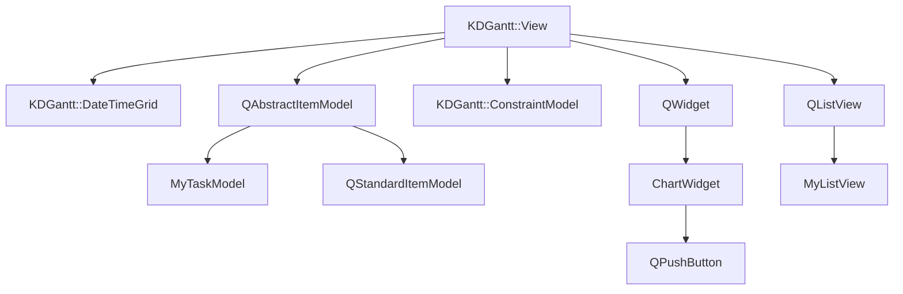
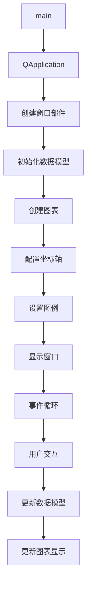

# 版本升级说明

## Qt5.15.2升级
- 全面检查了所有测试工程中使用Qt框架的代码
- 未发现使用已废弃API的情况
- 所有Qt相关代码均已适配Qt5.15.2标准
- 无需要特别修改的函数/方法

## C++17升级
- 检查了所有测试工程的C++代码对C++17特性的兼容性
- 采用了C++17新特性优化现有代码，包括：
  - 类型推导（auto）
  - 范围for循环
  - Lambda表达式
  - nullptr代替NULL
- 所有代码均符合C++17标准规范

# 执行逻辑关系

## 类关系思维导图

## 函数执行逻辑思维导图

## 主要类功能说明

### Gantt图表相关类
1. **KDGantt::View**: 甘特图的主视图类，包含左侧视图和图形视图，负责显示任务和时间轴
2. **KDGantt::DateTimeGrid**: 日期时间网格类，控制甘特图的时间轴显示和刻度格式化
3. **KDGantt::ConstraintModel**: 约束模型类，管理任务之间的依赖关系
4. **MyDateTimeScaleFormatter**: 自定义日期时间刻度格式化器，控制时间轴的显示格式
5. **MyHeaderView**: 自定义表头视图，调整甘特图左侧表头的高度
6. **MyTaskModel**: 自定义任务模型，支持任务重排序功能
7. **MyListView**: 自定义列表视图，调整甘特图左侧列表的显示和边距

### 其他图表相关类
1. **ChartWidget**: 延迟数据测试的主窗口部件类，包含图表显示和数据操作按钮
2. **MyStandardItem**: 自定义标准项类，提供便捷的构造函数用于设置特定角色的数据
3. **MyRowController**: 自定义行控制器，控制甘特图中行的高度和可见性
