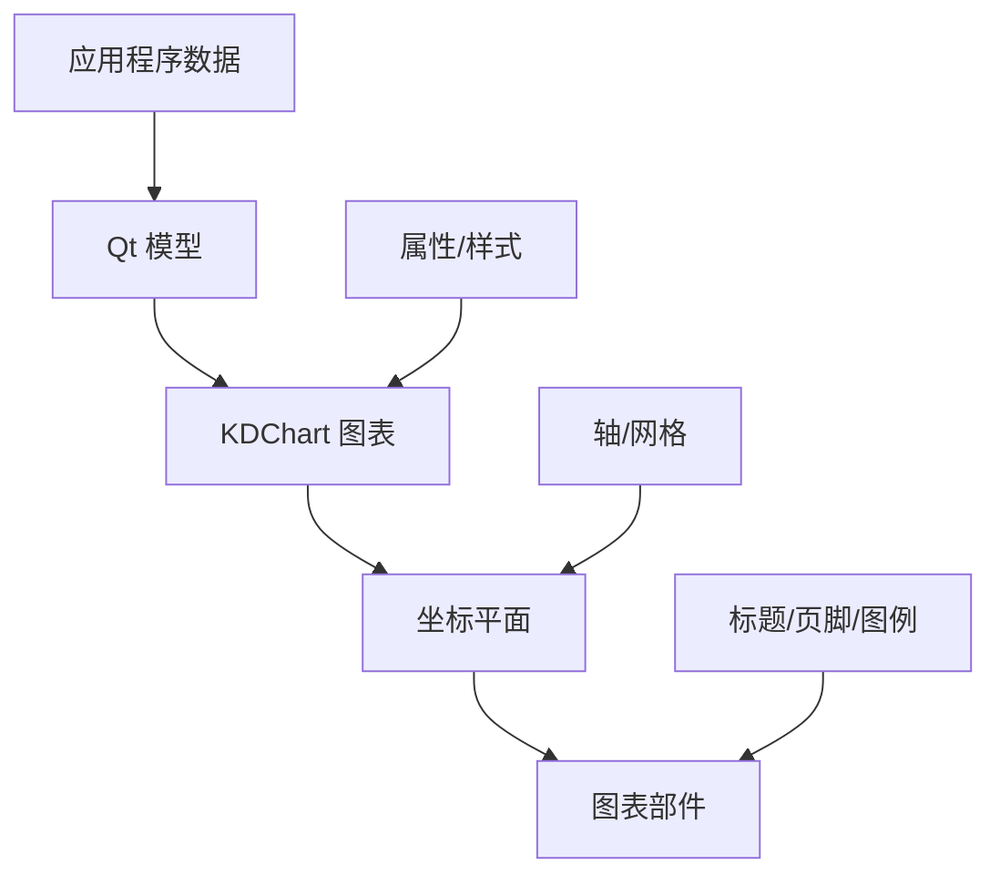

# 概述

- 5分钟	等级: 入门

KD Chart 是一个强大的基于 Qt 的图表库,旨在用于在 C++ 应用程序中创建专业的商业和科学图表。它提供了一整套图表类型和广泛的定制选项,同时保持合理的默认设置,以减少开发时间。

KD Chart 是一个复杂的图表库,为 C++ 开发者提供了在 Qt 应用程序中创建视觉吸引力和数据丰富的图表的工具。该库由 Klarälvdalens Datakonsult AB (KDAB) 开发和维护,支持 Qt5(需要 C++11)和 Qt6(需要 C++17)。

该库的设计注重灵活性——它允许开发者用最少的代码创建基本图表,同时为高级需求提供深度定制选项。KD Chart 处理了渲染复杂可视化、坐标变换和交互元素的繁重工作,以便您可以专注于应用程序的核心功能。

来源:[README.md](https://zread.ai/cheng25/KDChart/README.md), [README\_zh\_CN.md](https://zread.ai/cheng25/KDChart/README_zh_CN.md)

## 主要特性

KD Chart 提供了丰富的特性,使其适用于广泛的图表应用:

| 特性类别 | 能力 |
| --- | --- |
| 图表类型 | 柱状图、折线图、饼图/环形图、极坐标图/雷达图、股票图、甘特图、Levey-Jennings 图、三元图 |
| 定制 | 所有图表元素的广泛样式设置、多个轴、自定义背景 |
| 交互 | 缩放功能、实时更新、工具提示 |
| 数据处理 | Qt Model/View 集成、SQL 数据源、空值处理 |
| 布局 | 标题、页脚、图例、灵活定位 |
| 集成 | Python 绑定、WebAssembly 支持、可绘制到自定义画师 |

来源:[README.md](https://zread.ai/cheng25/KDChart/README.md)

## 图表类型

KD Chart 支持三大类图表,每类包含专门的图表类型:

### 笛卡尔图表

使用 X 和 Y 坐标在矩形平面上的图表:

* 柱状图:垂直或水平柱状图,用于比较离散类别
* 折线图:连接点显示随时间或类别的趋势
* 股票图:专为金融数据可视化设计
* 绘图器图表:散点图和类似的基于点的可视化
* Levey-Jennings 图表:专为实验室环境中的质量控制设计的图表

来源:[KDChartBarDiagram.h](https://zread.ai/cheng25/KDChart/src/KDChart/Cartesian/KDChartBarDiagram.h), [KDChartLineDiagram.h](https://zread.ai/cheng25/KDChart/src/KDChart/Cartesian/KDChartLineDiagram.h), [KDChartStockDiagram.h](https://zread.ai/cheng25/KDChart/src/KDChart/Cartesian/KDChartStockDiagram.h), [KDChartPlotter.h](https://zread.ai/cheng25/KDChart/src/KDChart/Cartesian/KDChartPlotter.h), [KDChartLeveyJenningsDiagram.h](https://zread.ai/cheng25/KDChart/src/KDChart/Cartesian/KDChartLeveyJenningsDiagram.h)

### 极坐标图表

使用角坐标在圆形平面上的图表:

* 饼图:圆形图表,分为多个扇区以显示比例
* 环形图:类似于饼图,但中心有孔
* 极坐标图:使用距中心的距离和角度绘制数据
* 雷达图:多变量数据显示在从中心点开始的轴上

来源:[KDChartPieDiagram.h](https://zread.ai/cheng25/KDChart/src/KDChart/Polar/KDChartPieDiagram.h), [KDChartRingDiagram.h](https://zread.ai/cheng25/KDChart/src/KDChart/Polar/KDChartRingDiagram.h), [KDChartPolarDiagram.h](https://zread.ai/cheng25/KDChart/src/KDChart/Polar/KDChartPolarDiagram.h), [KDChartRadarDiagram.h](https://zread.ai/cheng25/KDChart/src/KDChart/Polar/KDChartRadarDiagram.h)

### 甘特图表

专用于项目管理的图表:

* 基于时间线的任务、资源和依赖关系的可视化
* 支持元素之间的约束

来源:[kdganttview.h](https://zread.ai/cheng25/KDChart/src/KDGantt/kdganttview.h)

### 其他专用图表

* 三元图:用于可视化三种成分的混合物

来源:[examples/TernaryCharts](https://zread.ai/cheng25/KDChart/examples/TernaryCharts)

## 架构概述

KD Chart 采用模块化架构,将数据处理与可视化分离:

这种架构提供了多个好处:

* 关注点分离:数据、外观和布局独立处理
* 灵活性:在单个视图中混合不同的图表类型或坐标系统
* 定制:每个视觉方面都可以通过属性类进行定制
* 集成:与 Qt 的 Model/View 架构无缝工作

来源:[KDChartAbstractDiagram.h](https://zread.ai/cheng25/KDChart/src/KDChart/KDChartAbstractDiagram.h), [KDChartAbstractCoordinatePlane.h](https://zread.ai/cheng25/KDChart/src/KDChart/KDChartAbstractCoordinatePlane.h), [KDChartWidget.h](https://zread.ai/cheng25/KDChart/src/KDChart/KDChartWidget.h)

## 下一步

要在您的应用程序中使用 KD Chart:

1. **安装**：按照[安装指南](https://zread.ai/cheng25/KDChart/3-installation-guide)为您的环境设置 KD Chart

2. **快速入门**：查看[快速入门](https://zread.ai/cheng25/KDChart/2-quick-start)指南，创建您的第一个图表

3. **示例**：探索[示例画廊](https://zread.ai/cheng25/KDChart/5-examples-gallery)，了解可能性

4. **文档**：参考[API 参考](https://zread.ai/cheng25/KDChart/18-api-reference)获取详细信息

   

[快速入门.md](快速入门.md)

​	[快速入门>](https://zread.ai/cheng25/KDChart/2-quick-start)

